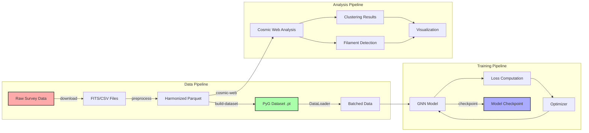

# AstroLab Architecture Overview

## 🏗️ Module Overview Diagram



```mermaid
graph TB
    %% CLI Interface
    CLI["astro-lab CLI"]
    CLI --> PREPROCESS[preprocess]
    CLI --> TRAIN[train]
    CLI --> INFO[info]
    CLI --> COSMIC_WEB_CMD[cosmic-web]
    CLI --> HPO[hpo]
    CLI --> CONFIG_CMD[config]
    CLI --> DOWNLOAD[download]

    %% Core Data Pipeline
    subgraph "Data Processing"
        DATA["data/"]
        DATA --> COLLECTORS[collectors/]
        DATA --> PREPROCESSORS[preprocessors/]
        DATA --> DATASET[dataset/]
        DATA --> ANALYSIS[analysis/]
        DATA --> SAMPLERS[samplers/]
        DATA --> TRANSFORMS[transforms/]
        DATA --> INFO_DATA[info.py]
    end

    %% Models
    subgraph "Models"
        MODELS["models/"]
        MODELS --> BASE_MODEL[AstroBaseModel]
        MODELS --> ASTRO_MODEL[AstroModel]
        MODELS --> AUTOENCODERS[autoencoders/]
        MODELS --> ENCODERS[encoders/]
        MODELS --> LAYERS[layers/]
        LAYERS --> LAYERS_ENCODERS[encoders/]
        LAYERS --> LAYERS_DECODERS[decoders/]
        LAYERS --> LAYERS_HEADS[heads/]
        LAYERS --> LAYERS_OTHER[convolution, normalization, pooling, point_cloud, hetero, graph]
        MODELS --> UTILS[utils/]
        MODELS --> MIXINS[mixins.py]
    end

    %% Tensors
    subgraph "Tensors"
        TENSORS["tensors/"]
        TENSORS --> SPATIAL[spatial/]
        TENSORS --> PHOTOMETRIC[photometric.py]
        TENSORS --> SPECTRAL[spectral.py]
        TENSORS --> TEMPORAL[temporal.py]
        TENSORS --> LIGHTCURVE[lightcurve.py]
        TENSORS --> BASE_TENSOR[base.py]
        TENSORS --> COSMOLOGY[cosmology.py]
        TENSORS --> IMAGE[image.py]
        TENSORS --> ORBITAL[orbital.py]
        TENSORS --> SIMULATION[simulation.py]
        TENSORS --> SURVEY[survey.py]
        TENSORS --> MIXINS_TENSOR[mixins.py]
        TENSORS --> ANALYSIS_TENSOR[analysis.py]
        TENSORS --> CROSSMATCH[crossmatch.py]
    end

    %% Training
    subgraph "Training"
        TRAINING["training/"]
        TRAINING --> TRAINER[trainer.py]
        TRAINING --> TRAIN_FN[train.py]
    end

    %% Visualization
    subgraph "Visualization"
        WIDGETS["widgets/"]
        WIDGETS --> ALBPY[albpy/]
        WIDGETS --> ALCG[alcg/]
        WIDGETS --> ALPV[alpv/]
        WIDGETS --> ENHANCED[enhanced/]
        WIDGETS --> PLOTLY[plotly/]
        WIDGETS --> EXAMPLES[examples/]
        WIDGETS --> TNG50[tng50.py]
        WIDGETS --> COSMOGRAPH_BRIDGE[cosmograph_bridge.py]
    end

    %% UI
    subgraph "UI/Interactive"
        UI["ui/"]
        UI --> APP[app.py]
        UI --> DASHBOARD[dashboard.py]
        UI --> COMPONENTS[components/]
        UI --> PAGES[pages/]
    end

    %% Config
    subgraph "Configuration"
        CONFIG["config/"]
        CONFIG --> CONFIG_VALIDATOR[config_validator.py]
        CONFIG --> CONFIG_PY[config.py]
        CONFIG --> YAML[*.yaml]
    end

    %% CLI to Core
    PREPROCESS --> DATA
    TRAIN --> MODELS
    TRAIN --> TRAINING
    COSMIC_WEB_CMD --> DATA
    COSMIC_WEB_CMD --> WIDGETS
    INFO --> DATA
    CONFIG_CMD --> CONFIG
    DOWNLOAD --> DATA

    %% Data to Models
    DATASET --> TENSORS
    MODELS --> LAYERS
    ASTRO_MODEL --> LAYERS
    BASE_MODEL --> LAYERS

    %% Training to Models
    TRAINER --> MODELS
    TRAIN_FN --> MODELS

    %% Visualization to Data/Models
    WIDGETS --> DATA
    WIDGETS --> MODELS

    %% UI to Everything
    UI --> WIDGETS
    UI --> DATA
    UI --> MODELS
    UI --> TRAINING

    %% Config to Everything
    CONFIG --> DATA
    CONFIG --> MODELS
    CONFIG --> TRAINING

    %% Style
    style CLI fill:#f9f,stroke:#333,stroke-width:4px
    style MODELS fill:#bbf,stroke:#333,stroke-width:2px
    style DATA fill:#bfb,stroke:#333,stroke-width:2px
    style TENSORS fill:#fbf,stroke:#333,stroke-width:2px
    style WIDGETS fill:#ffb,stroke:#333,stroke-width:2px
    style UI fill:#bff,stroke:#333,stroke-width:2px
    style CONFIG fill:#eee,stroke:#333,stroke-width:2px
    style TRAINING fill:#fbb,stroke:#333,stroke-width:2px
```

## 📋 CLI vs README Discrepancies

### ❌ Issues Found:

1. **Model Types in CLI vs README**
   - **CLI (`__main__.py`)**: Only supports `["gcn", "gat", "sage", "gin"]`
   - **README**: Claims support for `["gcn", "gat", "sage", "gin", "transformer", "pointnet", "temporal"]`
   - **Fix needed**: Update CLI to support all model types

2. **Train Command Arguments**
   - **CLI**: Has `--model` parameter
   - **README**: Shows `--model` in examples
   - **Actual train.py**: Uses `--model-type`
   - **Fix needed**: Standardize to `--model`

3. **Missing Commands in CLI**
   - **README**: Shows `astro-lab process` command
   - **CLI**: No `process` command, only `preprocess`
   - **Fix needed**: Either add `process` command or update README

4. **Optimize Command**
   - **README**: Shows `astro-lab optimize` 
   - **CLI**: Has `astro-lab hpo` instead
   - **Fix needed**: Either rename `hpo` to `optimize` or update README

### ✅ Correctly Documented:

1. **Supported Surveys**: Match between CLI and README
2. **Basic Commands**: preprocess, train, info, cosmic-web, config
3. **Task Types**: node_classification, graph_classification, etc.
4. **Core Parameters**: epochs, batch-size, learning-rate, etc.

## 🔧 Required Fixes

### 1. Update CLI to support all model types:

```python
# In __main__.py, update train_parser:
train_parser.add_argument(
    "--model",
    choices=["gcn", "gat", "sage", "gin", "transformer", "pointnet", "temporal", "auto"],
    default="auto",
    help="Model architecture (default: auto - uses survey recommendation)",
)
```

### 2. Standardize parameter naming:

```python
# In train.py, change:
parser.add_argument("--model-type", ...) 
# To:
parser.add_argument("--model", ...)
```

### 3. Add alias for optimize command:

```python
# In __main__.py, add:
optimize_parser = subparsers.add_parser(
    "optimize",
    help="Hyperparameter optimization (alias for hpo)",
    # ... same as hpo_parser
)
```

### 4. Update README or add process command:

Either:
- Add `process` as an alias for `preprocess` in CLI
- Or update README to use `preprocess` consistently

## 📊 Data Flow Diagram



## 🎯 Module Responsibilities

### Core Modules:

1. **`data/`** - Data loading, preprocessing, survey handlers
   - Survey-specific loaders (gaia.py, sdss.py, etc.)
   - Cosmic web analysis algorithms
   - Dataset classes for PyTorch Geometric

2. **`models/`** - GNN architectures and layers
   - Base model with Lightning integration
   - AstroModel with all conv types
   - Custom layers (PointNet, Temporal)

3. **`tensors/`** - Domain-specific tensor containers
   - Spatial data (coordinates, distances)
   - Photometric data (magnitudes, colors)
   - Time series data (lightcurves, evolution)

4. **`training/`** - Training infrastructure
   - AstroTrainer (Lightning extension)
   - Training loops and utilities
   - MLflow integration

5. **`widgets/`** - Visualization backends
   - Interactive 3D visualization
   - Multiple backend support
   - Real-time updates

6. **`config/`** - Configuration management
   - Survey configurations
   - Model defaults
   - Training parameters

7. **`ui/`** - Interactive interfaces
   - Marimo-based UI
   - Analysis workflows
   - Visualization tools

8. **`cli/`** - Command-line interface
   - Entry points for all operations
   - Argument parsing
   - Command routing
