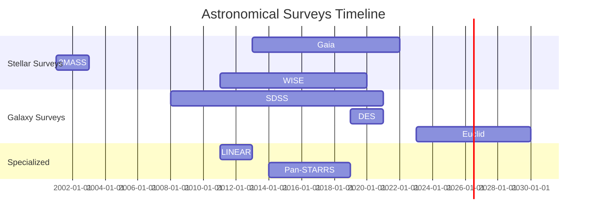

# Astronomical Surveys Overview

This document provides a comprehensive overview of the astronomical surveys used in the AstroLab project, including their data sources, coverage, and official links.

## Survey Comparison Table

| **Survey** | **Type** | **Data Source / Instrument** | **Coverage** | **Organization** | **Official Website** | **Description** |
|------------|----------|------------------------------|--------------|------------------|---------------------|-----------------|
| **Gaia** | Stellar Catalog | ESA Gaia Satellite | Full Sky | ESA (European Space Agency) | [Gaia Mission](https://www.cosmos.esa.int/web/gaia) | Precise positions, motions, and brightness of over 1.8 billion stars |
| **2MASS** | Infrared | 2 Telescopes (USA, Chile) | Full Sky | UMass, IPAC, NASA | [2MASS](https://www.ipac.caltech.edu/2mass/) | Infrared sky survey, 470 million objects |
| **WISE** | Infrared | WISE Satellite | Full Sky | NASA/JPL | [WISE](https://www.nasa.gov/mission_pages/WISE/main/index.html) | Infrared satellite, discovery of asteroids, stars, galaxies |
| **SDSS** | Optical/Spectrum | Sloan Telescope (New Mexico) | 14,555 sq. deg. | SDSS Collaboration | [SDSS](https://www.sdss.org/) | Multi-band imaging and spectroscopy, millions of galaxies and stars |
| **DES** | Optical | DECam (Cerro Tololo, Chile) | 5,000 sq. deg. | Dark Energy Survey | [DES](https://www.darkenergysurvey.org/) | Dark energy investigation, galaxies, supernovae |
| **Pan-STARRS** | Optical | PS1/PS2 (Hawaii) | 3/4 of sky | University of Hawaii | [Pan-STARRS](https://panstarrs.stsci.edu/) | Time-variable objects, asteroids, supernovae |
| **Euclid** | Optical/NIR | ESA Euclid Satellite | 15,000 sq. deg. | ESA | [Euclid Mission](https://www.euclid-ec.org/) | Cosmology, dark matter/energy, galaxy distribution |
| **TNG50** | Simulation | IllustrisTNG (Numerical Simulation) | Virtual (Simulation) | IllustrisTNG Collaboration | [TNG Project](https://www.tng-project.org/) | Cosmological simulation of galaxy formation |
| **NSA** | Galaxy Catalog | SDSS, GALEX, 2MASS, WISE | SDSS footprint | NYU, SDSS | [NSA Catalog](https://www.sdss.org/dr17/manga/nsa/) | Nearby galaxies, multi-wavelength data |
| **Exoplanet** | Planetary Systems | Various telescopes | Targeted observations | Multiple | [NASA Exoplanet Archive](https://exoplanetarchive.ipac.caltech.edu/) | Exoplanet discoveries and characterizations |
| **RR Lyrae** | Variable Stars | Various surveys | Full sky | Multiple | [OGLE](http://ogle.astrouw.edu.pl/) | RR Lyrae variable stars for distance measurements |
| **LINEAR** | Near-Earth Objects | LINEAR telescopes | Full sky | MIT Lincoln Laboratory | [LINEAR](https://www.ll.mit.edu/r-d/laboratories/laboratory-lincoln-laboratory) | Near-Earth asteroid detection |

## Survey Classification by Type

### Stellar Surveys
- **Gaia**: High-precision stellar astrometry
- **2MASS**: Infrared stellar catalog
- **WISE**: Infrared stellar and galactic objects
- **Exoplanet**: Planetary system discoveries
- **RR Lyrae**: Variable stars for distance measurements

### Galaxy Surveys
- **SDSS**: Large-scale galaxy mapping
- **DES**: Dark energy and galaxy evolution
- **Euclid**: Cosmological galaxy distribution
- **NSA**: Nearby galaxy catalog
- **Pan-STARRS**: Time-domain galaxy studies

### Simulations
- **TNG50**: Cosmological galaxy formation simulation

### Specialized Surveys
- **LINEAR**: Near-Earth object detection

## Data Access Methods

| **Survey** | **Data Access** | **API/Interface** | **File Formats** |
|------------|-----------------|-------------------|------------------|
| Gaia | ESA Gaia Archive | [Gaia Archive](https://gea.esac.esa.int/archive/) | FITS, CSV, VOTable |
| 2MASS | IRSA | [IRSA](https://irsa.ipac.caltech.edu/) | FITS, ASCII |
| WISE | IRSA | [IRSA](https://irsa.ipac.caltech.edu/) | FITS, ASCII |
| SDSS | SDSS Science Archive | [SDSS DR17](https://www.sdss.org/dr17/) | FITS, CSV |
| DES | NOIRLab | [DES Data Release](https://www.noirlab.edu/science/programs/ctio/dark-energy-survey-des) | FITS, CSV |
| Pan-STARRS | MAST | [MAST](https://mast.stsci.edu/) | FITS, CSV |
| Euclid | ESA Euclid Archive | [Euclid Archive](https://www.cosmos.esa.int/web/euclid/euclid-archive) | FITS, VOTable |
| TNG50 | TNG Project | [TNG Data](https://www.tng-project.org/data/) | HDF5, FITS |
| NSA | SDSS | [NSA Catalog](https://www.sdss.org/dr17/manga/nsa/) | FITS, CSV |

## Survey Timeline

## Data Volume Comparison

| **Survey** | **Objects** | **Data Size** | **Update Frequency** |
|------------|-------------|---------------|---------------------|
| Gaia | ~1.8 billion stars | ~1.5 PB | Every 6 months |
| SDSS | ~1 billion objects | ~100 TB | Every 2-3 years |
| DES | ~300 million galaxies | ~50 TB | Final release |
| 2MASS | ~470 million objects | ~10 TB | Static |
| WISE | ~750 million objects | ~20 TB | Static |
| Pan-STARRS | ~3 billion objects | ~2 PB | Static |
| Euclid | ~1.5 billion galaxies | ~50 PB (expected) | Every 6 months |

## Survey Footprints

### Northern Hemisphere
- **SDSS**: Northern Galactic Cap
- **Pan-STARRS**: Northern sky (δ > -30°)
- **LINEAR**: Northern sky

### Southern Hemisphere
- **DES**: Southern sky (δ < +2°)
- **2MASS**: Full sky (Southern telescope in Chile)

### Full Sky Coverage
- **Gaia**: Complete sky coverage
- **WISE**: Complete sky coverage
- **Euclid**: Deep fields + wide survey

## Key Scientific Goals

### Stellar Astrophysics
- **Gaia**: Galactic structure, stellar evolution, exoplanet detection
- **2MASS**: Stellar populations, brown dwarfs, galactic structure
- **WISE**: Brown dwarfs, star formation, galactic structure

### Galaxy Evolution
- **SDSS**: Large-scale structure, galaxy evolution, cosmology
- **DES**: Dark energy, galaxy clusters, supernovae
- **Euclid**: Dark energy, dark matter, galaxy evolution

### Cosmology
- **TNG50**: Galaxy formation, dark matter, cosmic web
- **DES**: Dark energy equation of state
- **Euclid**: Dark energy and dark matter distribution

## Data Quality Metrics

| **Survey** | **Positional Accuracy** | **Photometric Accuracy** | **Depth** | **Spatial Resolution** |
|------------|------------------------|--------------------------|-----------|------------------------|
| Gaia | ~10 μas | ~1 mmag | G < 21 | 0.1" |
| SDSS | ~0.1" | ~2% | r < 22.2 | 1.4" |
| DES | ~0.1" | ~1% | r < 24.1 | 0.9" |
| 2MASS | ~0.5" | ~3% | Ks < 14.3 | 2.0" |
| WISE | ~0.5" | ~5% | W1 < 17.1 | 6.1" |
| Pan-STARRS | ~0.1" | ~1% | r < 23.3 | 1.0" |

## Integration in AstroLab

The AstroLab project integrates these surveys through:

1. **Data Collectors**: Automated data retrieval from official archives
2. **Preprocessors**: Data cleaning and standardization
3. **Converters**: Transformation to PyTorch Geometric format
4. **Analysis Tools**: Cross-survey analysis and visualization

### Supported Features
- Multi-survey data fusion
- Cross-matching between surveys
- Machine learning on combined datasets
- Interactive visualization
- Real-time data access

## References

- [ESA Gaia Mission](https://www.cosmos.esa.int/web/gaia)
- [SDSS Collaboration](https://www.sdss.org/)
- [Dark Energy Survey](https://www.darkenergysurvey.org/)
- [Euclid Mission](https://www.euclid-ec.org/)
- [IllustrisTNG Project](https://www.tng-project.org/)
- [NASA Exoplanet Archive](https://exoplanetarchive.ipac.caltech.edu/)

---

*Last updated: 2024*
*Data sources: Official survey websites and publications* 